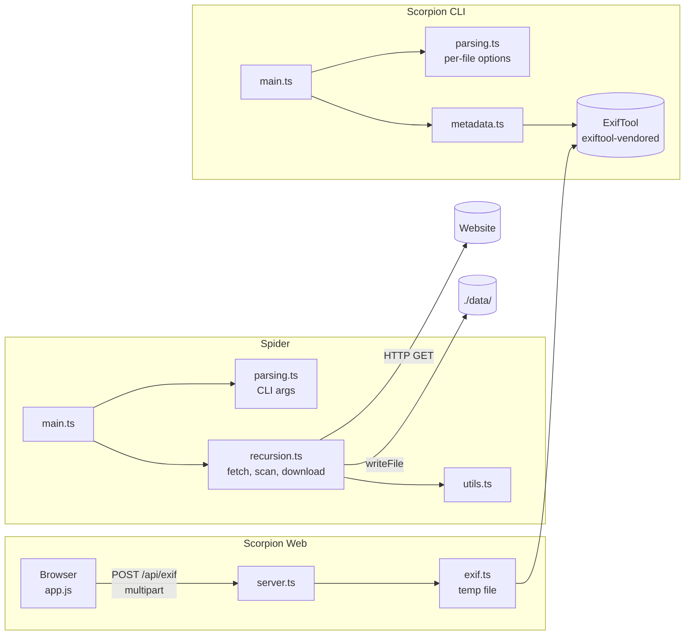
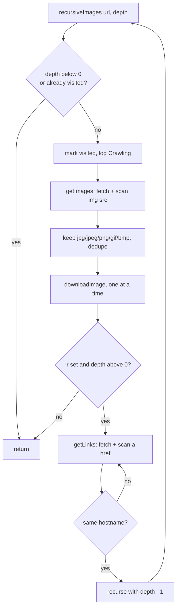

# Arachnida

A TypeScript implementation of the **42 Arachnida** project, made of two programs and a web interface:

- **Spider**: crawls a website (optionally recursively) and downloads its images.
- **Scorpion**: reads image metadata (EXIF and more), and can write or delete tags (bonus).
- **Scorpion Web**: a browser UI to upload an image, search its metadata and copy it as JSON (bonus).

Everything runs directly through [`tsx`](https://tsx.is): there is no build step. HTTP, HTML scanning, recursion and file writing in Spider are implemented in the project itself (Node built-ins only); Scorpion delegates tag parsing and writing to ExifTool through `exiftool-vendored`.

---

## Table of contents

1. [Architecture](#architecture)
2. [Repository layout](#repository-layout)
3. [Quick start](#quick-start)
4. [Spider](#spider)
5. [Scorpion (CLI)](#scorpion-cli)
6. [Scorpion Web](#scorpion-web)
7. [Design decisions](#design-decisions)
8. [Scripts and dependencies](#scripts-and-dependencies)
9. [Manual test plan](#manual-test-plan)
10. [Subject compliance](#subject-compliance)
11. [Troubleshooting](#troubleshooting)
12. [Known issues](#known-issues)
13. [Possible improvements](#possible-improvements)

---

## Architecture



Spider flow for each page:



---

## Repository layout

```
.
├── Spider/
│   ├── main.ts           # entry point: parse args, create output dir, start crawl
│   ├── parsing.ts        # command-line parsing (-r, -l, -p, URL)
│   ├── recursion.ts      # fetch, HTML scanning, image download, recursion
│   ├── types.ts          # webCrawler type + list of valid extensions
│   └── utils.ts          # usage text, output directory creation
├── Scorpion/
│   ├── cli/
│   │   ├── main.ts       # entry point: write (if requested) then display, per file
│   │   ├── parsing.ts    # --set / --delete grouped per following file
│   │   ├── metadata.ts   # exiftool read / write wrappers
│   │   ├── types.ts      # imgObj type, tag-name regex
│   │   └── utils.ts      # usage text, tag-name validation
│   └── web/
│       ├── src/
│       │   ├── server.ts # node:http server, static files, POST /api/exif
│       │   └── exif.ts   # temp file + exiftool read
│       └── public/
│           ├── index.html
│           ├── app.js    # upload, preview, search, copy JSON
│           └── style.css
├── package.json
├── pnpm-lock.yaml
├── pnpm-workspace.yaml
└── tsconfig.json
```

---

## Quick start

Requirements: a recent Node.js LTS (the code uses the global `fetch` and top-level `await`) and [pnpm](https://pnpm.io).

```bash
pnpm install
pnpm check                                   # type-check the project

pnpm spider -r -l 2 -p ./data https://example.com
pnpm scorpion ./data/some-image.jpg
pnpm scorpion-web                            # http://localhost:3000
```

`pnpm check` runs `tsc --noEmit` on `Spider/**/*.ts` and `Scorpion/**/*.ts` (`strict` mode). The browser script `Scorpion/web/public/app.js` is plain JavaScript and is not type-checked.

The help text of both programs shows the names `./spider` and `./scorpion`, as in the subject. This repository does not ship such executables: the entry points are the pnpm scripts above.

---

## Spider

```
pnpm spider [-r] [-l N] [-p PATH] URL
```

`URL` must be the **last** argument and must include the scheme (`https://example.com`). `--help` (or no argument) prints the usage and exits with status 0.

### Options

| Option | Default | What it does | Edge cases |
|---|---|---|---|
| `-r` | off | Follows links found on each page and downloads their images too. Without it, only the given page is processed. | Only links on the **same hostname** as the starting URL are followed (`www.example.com` and `example.com` count as different hosts). |
| `-l N` | `5` | Maximum depth of the recursive download, counted in link hops from the start page. The start page is level 0; pages up to `N` hops away are downloaded, and the links found on level-`N` pages are not followed. | Must be an integer ≥ 0, otherwise `Invalid recursion depth` and exit status 1. Ignored without `-r`. `-l 0` with `-r` processes only the start page. The `(depth: N)` printed in the log is the number of levels still available below that page. |
| `-p PATH` | `./data/` | Directory where images are written. | Created recursively if missing. Relative to the current working directory. Existing files with the same name are overwritten. |
| `--help` | | Prints the usage. | |

Unknown options are silently ignored. `-l` or `-p` without a following value are ignored as well (and the URL parse then fails if they were the last argument).

### What gets downloaded

- Images found in `` attributes. Relative URLs are resolved against the page URL.
- Only these extensions, checked on the URL **path** (query string excluded, case-insensitive): `.jpg`, `.jpeg`, `.png`, `.gif`, `.bmp`.
- Duplicates are removed **within a page** only.
- Images are downloaded from **any host** (CDNs included). The same-hostname rule applies only to the pages that are crawled.
- The file name is the last segment of the URL path, as is (no percent-decoding). Because directories are discarded, a hostile URL cannot make Spider write outside the output directory.
- Downloads are sequential. A non-2xx response or a network error is logged on stderr and skipped.

### What is not detected

The HTML scan is regex based (`<source>`, CSS `background-image`, favicons, images injected by JavaScript, `<base href>`. Extension-less image URLs (`/photo?id=3`) are skipped.

### Output and exit status

```
Crawling: http://localhost:8000/ (depth: 5)
Downloaded: a.jpg
Crawling: http://localhost:8000/sub/page.html (depth: 4)
Downloaded: a.jpg
Downloaded: b.png
Crawling: http://localhost:8000/sub/deeper.html (depth: 3)
Downloaded: c.gif
```

(This is the output of `-r` on the test site from the [manual test plan](#manual-test-plan).)

Errors go to stderr. The exit status is 0 even if some downloads fail; an invalid `-l` gives 1, and an uncaught exception (for example an invalid URL argument) gives a Node stack trace and status 1.

### Examples

```bash
pnpm spider https://example.com                          # single page
pnpm spider -r https://example.com                       # recursive, up to 5 levels
pnpm spider -r -l 2 https://example.com
pnpm spider -r -l 3 -p ./downloads https://example.com
```

---

## Scorpion (CLI)

```
pnpm scorpion [OPTIONS] FILE1 [[OPTIONS] FILE2 ...]
```

For every file, Scorpion (1) applies the requested modifications, if any, then (2) prints all the metadata that ExifTool finds, as a pretty-printed object (`console.dir`, unlimited depth) under a `=== filename ===` header. Because it reads after writing, the output always shows the final state.

### Options

| Option | What it does | Edge cases |
|---|---|---|
| `--set FIELD=VALUE` | Writes a tag on the **next** file. Repeatable. | Only the first `=` splits field and value (`Description=a=b` works). `FIELD` must match `^[A-Za-z][A-Za-z0-9:_-]*$` (exit status 2 otherwise). An empty value is refused (exit status 1) because ExifTool would delete the tag: use `--delete`. |
| `--delete FIELD` | Removes a tag from the **next** file. Repeatable. | A tag can live in several groups: delete each one (`EXIF:Artist`, `XMP:Artist`). |
| `--help` | Prints the usage, exit status 0. | |

Rules that apply to both:

- **Options bind to the file that follows them.** In `--set Artist=Alice a.jpg --set Artist=Bob b.jpg`, Alice applies to `a.jpg` and Bob to `b.jpg`. A file with no options before it is only displayed.
- Arguments are parsed **completely before any file is touched**: a typo in the last argument cannot leave the earlier files half-modified.
- Options after the last file are an error (`options after the last file have no file to apply to`, exit status 1).
- If the same field is given to `--set` and `--delete` for one file, **delete wins**.
- Any argument starting with `--` that is not listed above is rejected (`unknown option`, exit status 1).
- Tags without a group use ExifTool's default group for that file type. When it matters, qualify the tag: `EXIF:Artist`, `XMP:Title`.

### Examples

```bash
pnpm scorpion image.jpg
pnpm scorpion image1.jpg image2.png image3.gif

pnpm scorpion --set Artist="John Doe" image.jpg
pnpm scorpion --set Artist="John Doe" --set Copyright="2026" image.jpg
pnpm scorpion --delete Copyright image.jpg
pnpm scorpion --set Artist="John Doe" --delete Copyright image.jpg

# different edits per file
pnpm scorpion --set Artist="Alice" image1.jpg --set Artist="Bob" --delete Copyright image2.jpg
```

### Formats

| Format | Read | Write |
|---|---|---|
| JPEG / JPG | yes | yes |
| PNG | yes | yes |
| GIF | yes | yes |
| BMP | yes | **no** (ExifTool cannot write BMP: you get a `[write error]` line and exit status 1, then the file is still displayed) |

Scorpion does not check file extensions: ExifTool reads whatever file it is given.

### Warnings, errors, exit status

| Message | Meaning | Exit status |
|---|---|---|
| `[write] file: nothing changed (unknown tag, same value or not writable)` | ExifTool updated nothing. | unchanged |
| `[write error] file: ...` | The write failed. Reading still happens. | 1 |
| `Failed to read metadata for file: ...` | The file cannot be read (missing, unreadable). Other files are still processed. | 1 |
| `--set field=value type not satisfied in flag` | `--set` without a value or without `=`. | 1 |
| `--delete requires a field to delete` | | 1 |
| `invalid tag name: "..."` | `--set` field with a forbidden character. | 2 |

> **Edits overwrite the original file and no backup is kept** (`-overwrite_original`). Work on copies.

---

## Scorpion Web

```
pnpm scorpion-web
```

Opens an HTTP server on **`127.0.0.1:3000`** (loopback only, fixed port) and prints `🦂 Scorpion Web → http://localhost:3000`.

### Features

- Drag and drop, or file picker (one image at a time, the first one is used).
- Image preview with file name and size.
- Metadata table with a live search on tag names **and** values, plus a tag counter (it shows the total, not the number of matches).
- Collapsible raw JSON with a *copy* button.
- Read-only: the web UI cannot modify metadata (use the CLI).
- The interface texts are in Italian; server error messages are in English.

### HTTP API

| Method and path | Body | Success | Errors |
|---|---|---|---|
| `GET /` and `GET /<file>` | | static files from `Scorpion/web/public` | `400 Bad request` (malformed URL or percent-encoding), `403` outside the public directory, `404` not found |
| `POST /api/exif` | `multipart/form-data` with a file field named **`image`** | `200 {"exif": {...}}` | `400 {"error":"Expected multipart/form-data"}`, `400 {"error":"No image was provided"}`, `500 {"error": "..."}` |
| other methods | | | `405` |

```bash
curl -F image=@photo.jpg http://localhost:3000/api/exif
```

### How an upload is handled

1. The request body is read in memory and the `image` part is extracted by a small multipart parser.
2. The file name sent by the client is reduced to its last path segment (`basename`, with `image` as fallback) and the bytes are written to a private temporary directory (`mkdtemp` under the OS temp dir, `scorpion-XXXXXX`), because ExifTool reads from a path.
3. ExifTool reads the tags, the result is returned as JSON, and the temporary directory is removed in a `finally` block. Nothing is kept after the request.

### Security properties

- Bound to loopback: not reachable from the network. There is no authentication, so do not change this.
- Static files: the URL is percent-decoded, normalized and must stay inside `public/`. `GET /..%2fpackage.json` returns 403.
- Upload file names cannot leave the temporary directory: `../../x` becomes `x`, and names such as `..` make the write fail (500) without touching anything outside it.
- Any exception in the request handler (malformed URL, bad percent-encoding, ...) is answered with `400` instead of terminating the server.
- The browser renders metadata with `textContent`, never `innerHTML`: tags with HTML in their value (a classic trick in image metadata) are displayed as text, not executed.
- The client refuses files whose MIME type does not start with `image/`. This is a convenience only: the server does not validate the type.

The only open point in the upload path is the missing size limit, see [Known issues](#known-issues).

---

## Design decisions

| Choice | Why | Trade-off / alternative |
|---|---|---|
| Plain `fetch` + regex for HTML | No scraping dependency; the subject wants the crawling logic written by the student. | Misses `srcset`, CSS images, JS-rendered images and unusual markup. An HTML parser (`node-html-parser`, `cheerio`) would be more robust. |
| Follow only same-hostname links | Prevents the crawl from wandering across the Internet. | `www.` and bare domains are different hosts; subdomains are skipped. |
| Depth passed as a parameter, depth-first recursion | No shared mutable state: each branch has its own remaining depth, so `-l N` is a real depth limit. | With one global visited set, a page first reached through a long path can hide a shorter path to it (see [Known issues](#known-issues)). A breadth-first queue would fix it. |
| Sequential downloads | Simple, gentle on servers, deterministic output. | Slow on image-heavy pages; a small concurrency pool would speed it up. |
| `exiftool-vendored` | Bundles ExifTool (no system install) and keeps one long-lived ExifTool process for all files. | Large dependency; it is a wrapper, so tag semantics are ExifTool's. |
| `-overwrite_original` | No `*_original` clutter next to the images. | Destructive. Documented in the usage text and here. |
| Parse every argument before writing | A bad command line cannot leave half-modified files. | Whole command is rejected for one typo. |
| `node:http`, no framework | One dependency fewer. | Hand-written multipart parser and router. |
| Temp file for uploads | ExifTool needs a path. | Disk I/O per request; mitigated by a private `mkdtemp` directory deleted afterwards and by `basename` on the client file name. |
| Bind to `127.0.0.1` | The web tool has no auth. | Not usable from another machine without a reverse proxy. |
| `tsx`, no build | Zero build step in development. | `pnpm check` is the only compile-time safety net. |

`pnpm-workspace.yaml` sets `allowBuilds: esbuild: false` (pnpm's build-script allow-list): esbuild's install script is not run. `tsx` keeps working because esbuild ships its binary as a prebuilt platform package. If pnpm warns about ignored build scripts, that is expected.

---

## Scripts and dependencies

| Script | Command | Description |
|---|---|---|
| `pnpm spider` | `tsx Spider/main` | Run Spider |
| `pnpm scorpion` | `tsx Scorpion/cli/main` | Run the Scorpion CLI |
| `pnpm scorpion-web` | `tsx Scorpion/web/src/server` | Start the web interface |
| `pnpm check` | `tsc --noEmit` | Type-check the project |

| Package | Version | Role |
|---|---|---|
| `exiftool-vendored` | `^38.3.0` | Read and write metadata (runtime) |
| `tsx` | `^4.23.15` | Run TypeScript directly (dev) |
| `typescript` | `^7.0.2` | Type-checking (dev) |
| `@types/node` | `^26.6.3` | Node.js typings (dev) |

`tsconfig.json`: target `ES2022`, module `ESNext`, resolution `Bundler`, `strict`. The package is `"type": "module"` (ESM, which allows the top-level `await` in `Spider/main.ts`).

---

## Manual test plan

### Spider against a local site

The site has three levels: `index.html` → `sub/page.html` → `sub/deeper.html`.

```bash
mkdir -p /tmp/site/sub
cp photo.jpg /tmp/site/a.jpg
cp photo.png /tmp/site/sub/b.png
cp photo.gif /tmp/site/sub/c.gif
cat > /tmp/site/index.html <<'EOF'
<html><body>

<a href="sub/page.html">sub</a>
<a href="https://example.org/">external</a>
</body></html>
EOF
cat > /tmp/site/sub/page.html <<'EOF'

<a href="deeper.html">deeper</a>
EOF
cat > /tmp/site/sub/deeper.html <<'EOF'

EOF
python3 -m http.server 8000 --directory /tmp/site &
```

Run each command on an empty output directory (`rm -rf /tmp/out` between runs) and check `ls /tmp/out`:

```bash
pnpm spider -p /tmp/out http://localhost:8000/             # a.jpg only (no -r)
pnpm spider -r -l 0 -p /tmp/out http://localhost:8000/     # a.jpg only: start page, no link followed
pnpm spider -r -l 1 -p /tmp/out http://localhost:8000/     # a.jpg, b.png: page.html crawled, deeper.html NOT
pnpm spider -r -l 2 -p /tmp/out http://localhost:8000/     # a.jpg, b.png, c.gif: deeper.html crawled
pnpm spider -r -p /tmp/out http://localhost:8000/          # default depth 5: same as -l 2 here; example.org not followed
```

The `(depth: N)` values in the log must go down by one at each level (`1, 0` for `-l 1`; `2, 1, 0` for `-l 2`).

Negative cases:

```bash
pnpm spider -r -l abc http://localhost:8000/    # "Invalid recursion depth", status 1
pnpm spider http://localhost:8000/ -r           # TypeError: Invalid URL (URL must be last)
pnpm spider --help                              # usage, status 0
```

### Scorpion

```bash
cp photo.jpg /tmp/t.jpg
pnpm scorpion /tmp/t.jpg
pnpm scorpion --set Artist="John Doe" --set Copyright=2026 /tmp/t.jpg   # Artist and Copyright now shown
pnpm scorpion --delete Artist /tmp/t.jpg                                # Artist gone
pnpm scorpion --set Artist=Alice /tmp/t.jpg --set Artist=Bob /tmp/t2.jpg
```

Negative cases (check `echo $?` after each):

```bash
pnpm scorpion --set Artist /tmp/t.jpg          # "--set field=value type not satisfied in flag"  -> 1
pnpm scorpion --set 1bad=x /tmp/t.jpg          # invalid tag name                                -> 2
pnpm scorpion --set Artist= /tmp/t.jpg         # empty value, use --delete                       -> 1
pnpm scorpion --foo /tmp/t.jpg                 # unknown option                                  -> 1
pnpm scorpion --set Artist=x                   # options after the last file...                  -> 1
pnpm scorpion /tmp/missing.jpg                 # Failed to read metadata                         -> 1
```

### Web

```bash
pnpm scorpion-web &
curl -s -F image=@/tmp/t.jpg http://localhost:3000/api/exif | head -c 300
curl -s -X POST -d x=1 http://localhost:3000/api/exif                 # 400 Expected multipart/form-data
curl -s -F other=@/tmp/t.jpg http://localhost:3000/api/exif           # 400 No image was provided
curl -s --path-as-is 'http://localhost:3000/..%2fpackage.json'        # Forbidden
curl -s -i 'http://localhost:3000/%' | head -n 1                      # HTTP/1.1 400 Bad Request, server still alive
curl -s -X DELETE -i http://localhost:3000/ | head -n 1               # 405
```

Upload file-name check (assuming the OS temp directory is `/tmp`):

```bash
curl -s -F 'image=@/tmp/t.jpg;filename=../traversal-test.jpg' http://localhost:3000/api/exif | head -c 100
ls /tmp/traversal-test.jpg      # must NOT exist
```

Then open `http://localhost:3000`, drop an image, type in the search box, expand the JSON and press the copy button.

---

## Subject compliance

| Requirement | Status |
|---|---|
| Spider: `./spider [-rlp] URL` | Implemented through `pnpm spider` (no `./spider` executable shipped) |
| `-r` recursive download | Implemented, same hostname only |
| `-l N` maximum depth level, default 5 | Implemented: depth counted in link hops from the start page, passed down the recursion |
| `-p PATH`, default `./data/` | Implemented |
| Extensions `.jpg/.jpeg/.png/.gif/.bmp` | Implemented |
| No tool that does the whole job (`wget`, `scrapy`) | Spider uses only Node built-ins |
| Scorpion: metadata of one or more files (creation date, EXIF, ...) | Implemented through ExifTool |
| Same extensions as Spider | Read: all four; write: all except BMP |
| **Bonus**: modify / delete metadata | `--set` and `--delete`, per file |
| **Bonus**: graphical interface | Web UI: upload, preview, search, JSON view (read-only) |

---

## Troubleshooting

| Symptom | Cause | Fix |
|---|---|---|
| `TypeError: Invalid URL` from Spider | URL missing, without scheme, or not the last argument | `pnpm spider -r https://example.com` (URL last, with `https://`) |
| Spider downloads nothing | Images are JS-rendered, in `srcset`/CSS, extension-less, or in another format | Open the page source and look for ``; see [What is not detected](#what-is-not-detected) |
| Fewer files than images on the site | Two URLs with the same file name overwrite each other | Use a different `-p` per run, or see [Known issues](#known-issues) |
| A flag such as `-r` seems ignored by `pnpm` | pnpm may interpret it | `pnpm exec tsx Spider/main -r https://example.com` |
| `[write] ... nothing changed` | Unknown tag, same value, or tag not writable in that format | Qualify the group (`EXIF:Artist`, `XMP:Title`) |
| `[write error]` on a `.bmp` | ExifTool cannot write BMP | Expected: BMP is read-only |
| `--set Artist=` rejected | Empty value would delete the tag | `--delete Artist` |
| `Error: listen EADDRINUSE 127.0.0.1:3000` | Port already used | Stop the other process (the port is hard-coded) |
| Web server answers 403 to everything | Windows path separators (see [Known issues](#known-issues)) | Run it on Linux/macOS or WSL |

---

## Known issues

Found by reading the code. Fixed items should be removed from this list.

| Severity | Where | Issue | Suggested fix |
|---|---|---|---|
| Medium | `Scorpion/web/src/server.ts` | The upload body is buffered in memory with no size limit (and then copied by the parser). | Reject bodies above a limit (for example 50 MB) with 413. |
| Medium | `Spider/recursion.ts` | `new URL(match[1], url)` is outside any `try/catch`: a malformed `href` or `src` (`href="http://"`) aborts the whole crawl. | Wrap in `try/catch` and `continue`. |
| Medium | `Spider/recursion.ts` | Files are named after the last URL path segment: `/a/logo.png` and `/b/logo.png` overwrite each other; the same image on several pages is downloaded repeatedly. | Keep a global set of downloaded URLs and disambiguate names. |
| Low | `Spider/recursion.ts` | The crawl is depth-first with a global visited set: a page first reached through a long path (little depth left) is not re-explored when a shorter path reaches it later, so some pages within `-l` levels of the start page can be missed. | Crawl breadth-first with a queue of `{url, depth}`, so each page is first reached by its shortest path. |
| Low | `Spider/recursion.ts` | Every page is fetched twice (`getImages` then `getLinks`); `response.ok` and `Content-Type` are not checked (error pages and binaries are parsed as HTML); no timeout. | Fetch once and reuse the HTML; check status and type; add `AbortSignal.timeout`. |
| Low | `Spider/recursion.ts` | The visited set uses the raw URL: `/page`, `/page/` and `/page#top` are three pages. | Strip the fragment and normalize before `visitedUrls`. |
| Low | `Spider/parsing.ts` | Unknown options are ignored; an invalid URL gives a raw stack trace. | Reject unknown options, catch `new URL` errors with a clear message. |
| Low | `Scorpion/cli/parsing.ts` | `--delete` fields are not validated with the tag-name regex used by `--set`. | Call `checkTag` for `--delete` too. |
| Low | `Scorpion/web/src/server.ts` | The static-path check uses `"/"`, so it fails on Windows; the port is hard-coded; SIGINT exits without `exiftool.end()`. | Use `path.sep`, read `process.env.PORT`, `await exiftool.end()` before exit. |
| Info | repository | No `./spider` and `./scorpion` executables, only pnpm scripts. | Add small wrapper scripts if the evaluation requires those exact commands. |

---

## Possible improvements

- Parse HTML with a real parser and support `srcset`, `<picture>` and CSS images.
- Respect `robots.txt`, add a `User-Agent`, a delay between requests, and a download concurrency limit.
- Scorpion: optional backup (`--backup`) instead of always overwriting.
- Web: edit/delete tags from the UI, download the cleaned file ("strip all metadata" button).
- Add automated tests (for example `node:test` against a local fixture server, as in the [manual test plan](#manual-test-plan)).
- Add `engines` and `packageManager` fields in `package.json` to pin the Node.js and pnpm versions.

---
