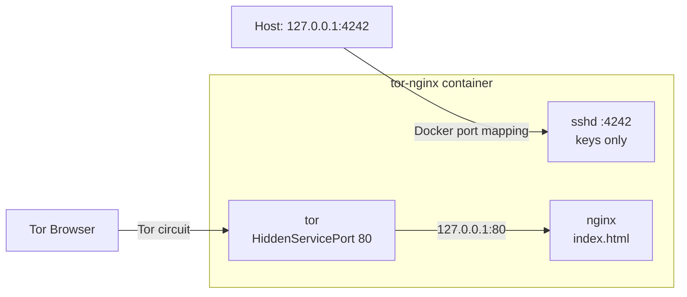

# ft_onion

A Docker container that publishes a static web page as a **Tor hidden service** (`xxxxxxxx.onion`) and allows **SSH access on port 4242**.

- **Web**: Nginx serves a single file, `index.html`, on port 80 (internal to the container, reachable only through Tor).
- **Tor**: exposes Nginx's port 80 as a v3 `.onion` address.
- **SSH**: `sshd` on port 4242, key-only authentication, hardened (bonus).
- **Interactivity** (bonus): `index.html` contains client-side JavaScript (terminal, simulated circuit, etc.). No backend, no external requests.

Versions: Debian 12 "bookworm" (`debian:bookworm-slim` image), OpenSSH 9.2p1, Nginx and Tor from the Debian repositories.

---

## Table of contents

1. [Architecture](#architecture)
2. [Repository layout](#repository-layout)
3. [Quick start](#quick-start)
4. [Generating the SSH keys](#generating-the-ssh-keys)
5. [Docker commands](#docker-commands)
6. [Checks and tests](#checks-and-tests)
7. [`torrc`: every value explained](#torrc-every-value-explained)
8. [`nginx.conf`: every value explained](#nginxconf-every-value-explained)
9. [`sshd_config`: every value explained](#sshd_config-every-value-explained)
10. [Dockerfile, entrypoint and compose: why they are built this way](#dockerfile-entrypoint-and-compose-why-they-are-built-this-way)
11. [Subject compliance](#subject-compliance)
12. [Backing up the onion address](#backing-up-the-onion-address)
13. [Troubleshooting](#troubleshooting)
14. [Limitations and possible improvements](#limitations-and-possible-improvements)

---

## Architecture



- Port 80 is **not published** by Docker: Nginx is reachable only from Tor, inside the container.
- Port 4242 is published **only on the host's `127.0.0.1`**: SSH is not exposed to the network.
- Three processes live in the same container (nginx, sshd, tor) because the subject asks for a single "machine" running all the services. See the [limitations](#limitations-and-possible-improvements) for the trade-off.

---

## Repository layout

```
.
├── index.html            # static page (deliverable)
├── nginx.conf            # Nginx configuration (deliverable)
├── sshd_config           # OpenSSH configuration (deliverable)
├── torrc                 # Tor configuration (deliverable)
├── Dockerfile            # image: debian + nginx + openssh-server + tor
├── docker-compose.yml    # ports, volumes, restart policy
├── entrypoint.sh         # starts sshd, nginx and tor
├── .gitignore            # excludes the keys
├── README.md
└── ssh-keys/             # NOT versioned: you generate it (see below)
    ├── ft_onion          # private key
    ├── ft_onion.pub      # public key
    └── authorized_keys   # copy of the public key, mounted in the container
```

---

## Quick start

Requirements: Docker Engine with the Compose v2 plugin (`docker compose`).

```bash
# 1. generate the keys (one time only)
mkdir -p ssh-keys
ssh-keygen -t ed25519 -f ./ssh-keys/ft_onion -N '' -C 'ft_onion'
cp ./ssh-keys/ft_onion.pub ./ssh-keys/authorized_keys
chmod 600 ./ssh-keys/ft_onion

# 2. build and start
docker compose up -d --build

# 3. wait for Tor to finish bootstrapping (1-2 minutes)
docker logs -f tor-nginx          # look for: "Bootstrapped 100% (done)"

# 4. read the onion address
docker exec tor-nginx cat /var/lib/tor/hidden_service/hostname

# 5. connect over SSH
ssh -o IdentitiesOnly=yes -i ./ssh-keys/ft_onion -p 4242 student@localhost
```

Then open the `.onion` address in **Tor Browser**.

---

## Generating the SSH keys

You need two things: a key pair on your host, and an `authorized_keys` file that the container copies into the `student` user's home.

```bash
mkdir -p ssh-keys

# ed25519 key pair without passphrase (handy for testing/evaluation)
ssh-keygen -t ed25519 -f ./ssh-keys/ft_onion -N '' -C 'ft_onion'

# with a passphrase (recommended for real use): omit -N ''
# ssh-keygen -t ed25519 -f ./ssh-keys/ft_onion -C 'ft_onion'

# the public key becomes the container's authorized_keys file
cp ./ssh-keys/ft_onion.pub ./ssh-keys/authorized_keys

# permissions: ssh refuses private keys readable by others
chmod 600 ./ssh-keys/ft_onion
```

Why **ed25519**: short, fast keys that avoid several implementation pitfalls of the other algorithms. The server accepts *only* this type (`PubkeyAcceptedAlgorithms ssh-ed25519`), so an RSA/ECDSA key would not work.

Check that the key matches the authorized one:

```bash
ssh-keygen -lf ./ssh-keys/ft_onion.pub
docker exec tor-nginx ssh-keygen -lf /home/student/.ssh/authorized_keys
# the two SHA256 fingerprints must be identical
```

**Never commit the private key.** `.gitignore` must contain:

```gitignore
ssh-keys/*
```

> Warning: the pattern `./ssh-keys/*` (with a leading `./`) **does not work** in `.gitignore`. Git does not recognise the `./` prefix. Use `ssh-keys/*`. Check with `git status` or `git check-ignore -v ssh-keys/ft_onion`.

If the `ssh-keys` directory does not exist when you run `docker compose up`, Docker creates it empty and owned by root, and the entrypoint exits with `ERROR: /keys/authorized_keys not found`.

---

## Docker commands

Run all commands from the project directory.

### Start

```bash
docker compose up -d --build        # build (if needed) + start in the background
docker compose up -d                # start without rebuilding
docker compose start                # restart a stopped container
```

### Stop / restart

```bash
docker compose stop                 # stop, keep container and volumes
docker compose restart              # restart
docker compose down                 # stop and REMOVE the container, keep the volumes
```

### Delete

```bash
docker compose down --rmi local     # also remove the built image
docker compose down -v              # also remove the volumes: YOU LOSE THE .onion ADDRESS
docker compose down -v --rmi local  # full project cleanup
docker system prune                 # (optional) remove unused Docker resources
```

> `down -v` deletes the `tor-data` volume, and with it the hidden service's private key. On the next start you will get **a different `.onion` address**. If you need the current one, make a [backup](#backing-up-the-onion-address) first. It also deletes the `ssh-hostkeys` volume, so the SSH host key will change.

### Rebuild from scratch

```bash
docker compose down
docker compose build --no-cache
docker compose up -d
```

After any change to `index.html`, `nginx.conf`, `sshd_config`, `torrc`, `Dockerfile` or `entrypoint.sh` you need `docker compose up -d --build` (the files are copied into the image, not mounted).

### Status and logs

```bash
docker compose ps                   # service status
docker ps -a --filter name=tor-nginx
docker logs tor-nginx               # all logs
docker logs -f tor-nginx            # follow in real time
docker logs --tail 50 tor-nginx     # last 50 lines
docker logs --since 10m tor-nginx   # last 10 minutes
docker stats tor-nginx              # CPU/RAM
docker compose config               # resolved compose file, useful for syntax errors
```

The logs show: Tor's progress (`Bootstrapped N%`), SSH logins (`Accepted publickey for student ... SHA256:...`) and failed attempts.

### Getting inside the container

```bash
docker exec -it tor-nginx bash                # shell as root
docker exec -it -u student tor-nginx bash     # shell as student
docker exec tor-nginx cat /var/lib/tor/hidden_service/hostname
```

### Volumes

```bash
docker volume ls
docker volume inspect <project>_tor-data      # the prefix is the folder name
docker volume inspect <project>_ssh-hostkeys
```

---

## Checks and tests

### Valid configurations

```bash
docker exec tor-nginx nginx -t
docker exec tor-nginx sshd -t
docker exec tor-nginx sshd -T | grep -Ei 'port|permitroot|passwordauth|kbdinteractive|pubkey|usepam|allowusers|forwarding|maxauth'
docker exec tor-nginx tor --verify-config -f /etc/tor/torrc
```

### Processes and ports inside the container

```bash
docker exec tor-nginx ps aux | grep -E 'nginx|sshd|tor'
docker exec tor-nginx ss -tlnp 2>/dev/null || docker exec tor-nginx cat /proc/net/tcp
```

Expected: nginx on `:80`, sshd on `:4242`, tor on `127.0.0.1:9050` (default SocksPort, internal only).

### Ports exposed by the host

```bash
docker port tor-nginx
# expected: 4242/tcp -> 127.0.0.1:4242   (and nothing else)
```

### Web through Tor

```bash
ONION=$(docker exec tor-nginx cat /var/lib/tor/hidden_service/hostname)

# with Tor Browser: open http://$ONION

# from the command line, with a Tor client on the host (SocksPort 9050) or Tor Browser (9150)
curl --socks5-hostname 127.0.0.1:9050 -s http://$ONION | head -n 5
# or
torsocks curl -s http://$ONION | head -n 5
```

Note: the address is not reachable in clear, so `curl http://$ONION` without a proxy fails.

### SSH: positive and negative tests

```bash
# must work
ssh -o IdentitiesOnly=yes -i ./ssh-keys/ft_onion -p 4242 student@localhost

# password: must fail (Permission denied (publickey))
ssh -o PubkeyAuthentication=no -p 4242 student@localhost

# root: must fail
ssh -o IdentitiesOnly=yes -i ./ssh-keys/ft_onion -p 4242 root@localhost

# another user: must fail
ssh -o IdentitiesOnly=yes -i ./ssh-keys/ft_onion -p 4242 nobody@localhost

# forwarding: must be refused
ssh -o IdentitiesOnly=yes -i ./ssh-keys/ft_onion -p 4242 -L 8080:127.0.0.1:80 -N student@localhost

# negotiated ciphers and algorithms
ssh -vv -o IdentitiesOnly=yes -i ./ssh-keys/ft_onion -p 4242 student@localhost 2>&1 | grep -E 'kex:|cipher'
```

Automated audit (external tool, optional):

```bash
pip install ssh-audit
ssh-audit -p 4242 127.0.0.1
```

### Host key changed after a rebuild

If you deleted the `ssh-hostkeys` volume, the client reports `REMOTE HOST IDENTIFICATION HAS CHANGED`:

```bash
ssh-keygen -R "[localhost]:4242"
```

---

## `torrc`: every value explained

```
DataDirectory /var/lib/tor
HiddenServiceDir /var/lib/tor/hidden_service/
HiddenServicePort 80 127.0.0.1:80
```

| Directive | Value | Why it is there |
|---|---|---|
| `DataDirectory` | `/var/lib/tor` | Directory where Tor stores its state, the network consensus and its cache. It must be writable by the `debian-tor` user (it is by default with the Debian package). Without persistent state Tor would have to download everything again at each start. |
| `HiddenServiceDir` | `/var/lib/tor/hidden_service/` | Enables the hidden service and tells Tor where to write `hostname` (the `.onion` address), `hs_ed25519_secret_key` and `hs_ed25519_public_key`. **The secret key is the site's identity**: whoever owns it can impersonate the site. That is why the folder is `700` and owned by `debian-tor` (Tor refuses to start if the permissions are wider) and lives on a Docker volume so it survives rebuilds. |
| `HiddenServicePort` | `80 127.0.0.1:80` | Maps the onion address's virtual port `80` to `127.0.0.1:80`, where Nginx listens. Using `127.0.0.1` means Nginx receives traffic only from the local Tor: there is no need to expose it on other interfaces and no way to reach it "sideways" around Tor. |

What is **not** there, and why that is fine:

- **Service version**: since Tor 0.4.6 only v3 services exist (56-character addresses, ed25519 cryptography). `HiddenServiceVersion 3` is not needed.
- **`SocksPort`**: with no directive, Tor opens a SOCKS port on `127.0.0.1:9050` *inside* the container. Docker does not publish it, so it cannot be reached from outside. To close it entirely you can add `SocksPort 0`.
- **`Log`**: the default (`notice` on stdout) ends up in `docker logs`.

What this configuration protects: the server's IP address never appears in DNS or in visitors' connections. The visitor does not learn the server's IP and the server does not learn the visitor's IP (they meet at a rendezvous point in the Tor network).

---

## `nginx.conf`: every value explained

```nginx
events {}

http {
    server {
        listen 80;
        listen [::]:80;

        server_name _;

        root /usr/share/nginx/html;
        index index.html;

        location / {
            try_files $uri $uri/ =404;
        }
    }
}
```

| Directive | Why it is there |
|---|---|
| `events {}` | Mandatory block: without it Nginx does not start. Empty = default values (no tuning needed for a static file). |
| `http { ... }` | Context for everything HTTP-related. |
| `listen 80;` / `listen [::]:80;` | Port required by the subject, on IPv4 and IPv6. Tor connects through `127.0.0.1:80`. Docker does **not** publish this port on the host. |
| `server_name _;` | "Catch-all" name: the request's `Host` will be the `.onion` address, which is unknown at build time, so the server answers to any name. |
| `root /usr/share/nginx/html;` | Folder of the served files. It contains only `index.html`, copied by the Dockerfile. |
| `index index.html;` | File served for `/`. |
| `location / { try_files $uri $uri/ =404; }` | Serves the file if it exists, otherwise 404. There is no `proxy_pass`, `fastcgi_pass` or `autoindex`: **there is no way to run server-side code or list directories**. This guarantees the static nature required by the subject. |

Useful details:

- There is no `include mime.types;`: Nginx applies its default `text/html` type to `.html` extensions, which is enough for a single `index.html`. If you add `.css`, `.js` or image files you must include `mime.types`, otherwise they are served with the wrong type.
- Nginx is started in daemon mode by the entrypoint and writes its logs to `/var/log/nginx/`.

---

## `sshd_config`: every value explained

Context: the service runs in a container, reachable through a port published on loopback. The settings remove everything that is not needed to do *one single thing*: interactive login of the `student` user with a key.

### Access and authentication

| Directive | Value | Why / what it protects against |
|---|---|---|
| `Port` | `4242` | Port required by the subject. A non-standard port reduces the noise from automated scanners on port 22; **it is not a security measure**. |
| `ListenAddress` | `0.0.0.0` | Listens on all interfaces *of the container*. This is needed because port-mapped traffic arrives from Docker's bridge interface. Exposure to the outside is limited by the `127.0.0.1:4242` binding in the compose file. |
| `PermitRootLogin` | `no` | root is the target of every brute-force attack. Even with a stolen key, nobody gets in as root. |
| `PasswordAuthentication` | `no` | Eliminates brute force and credential stuffing on passwords: there is no password to guess. |
| `KbdInteractiveAuthentication` | `no` | The second route to passwords (challenge-response, typically via PAM). It must be disabled together with the previous one, otherwise the server still advertises `keyboard-interactive`. In OpenSSH < 8.7 it was called `ChallengeResponseAuthentication`. |
| `PubkeyAuthentication` | `yes` | The only allowed method: public-key authentication. |
| `PermitEmptyPasswords` | `no` | Forbids accounts without a password. Already the default, made explicit for clarity and for audit tests. |
| `AllowUsers` | `student` | Whitelist: any other user is rejected, even if it exists and has a key. |
| `UsePAM` | `no` | Disables the PAM stack: less exposed code and no dependency on modules. With keys only, PAM is not needed. **Consequence**: sshd treats an account with `!` in `/etc/shadow` as "locked"; that is why the Dockerfile runs `usermod -p '*' student` (no password can match, but the account is not locked). |
| `PermitUserEnvironment` | `no` | Prevents setting environment variables through `~/.ssh/environment` or `authorized_keys` (e.g. `LD_PRELOAD`) to bypass restrictions. |

### Disabled features (reduce the attack surface)

| Directive | Value | Why / what it protects against |
|---|---|---|
| `X11Forwarding` | `no` | X11 forwarding exposes the client's display to a compromised server. Useless here. |
| `AllowTcpForwarding` | `no` | Blocks `-L`, `-R`, `-D`: the container cannot be used as a proxy/pivot toward other networks, nor to open reverse tunnels. It is the most important of this group for a service running next to Tor. |
| `PermitTunnel` | `no` | No layer 2/3 tunnels (`tun`/`tap`). |
| `AllowAgentForwarding` | `no` | If the server were compromised, it could not use the SSH agent forwarded by the client to authenticate elsewhere. |

### Session limits and anti-abuse

| Directive | Value | Why / what it protects against |
|---|---|---|
| `MaxAuthTries` | `3` | At most 3 attempts per connection before disconnecting. Slows down brute force. Note: every key offered by the agent counts as an attempt, so with many keys in the agent you get `Too many authentication failures`: use `-o IdentitiesOnly=yes -i <key>`. |
| `LoginGraceTime` | `20` | Seconds allowed to complete authentication. Frees "hanging" connections quickly, mitigating exhaustion of the unauthenticated-connection slots (slowloris style). |
| `MaxSessions` | `2` | Maximum multiplexed sessions per connection. Limits abuse of a single authenticated connection. |
| `ClientAliveInterval` | `300` | Every 300 s the server sends an encrypted keepalive message. |
| `ClientAliveCountMax` | `2` | After 2 unanswered keepalives (about 10 minutes) the session is closed. Removes sessions of dead or disconnected clients. It does not close an idle session whose client still answers. |

### Cryptography

| Directive | Value | Why / what it protects against |
|---|---|---|
| `HostKey` | `/etc/ssh/hostkeys/ssh_host_ed25519_key` | Uses only the ed25519 host key, stored on a volume: it stays identical across restarts and rebuilds, avoiding the `REMOTE HOST IDENTIFICATION HAS CHANGED` warning (which trains people to ignore warnings, i.e. to miss a real MITM attack). |
| `PubkeyAcceptedAlgorithms` | `ssh-ed25519` | Accepts only ed25519 user keys. Excludes RSA/ECDSA/DSA and legacy SHA-1 signatures. Name valid since OpenSSH 8.5 (before: `PubkeyAcceptedKeyTypes`). |
| `KexAlgorithms` | `curve25519-sha256,curve25519-sha256@libssh.org` | Key exchange only with Curve25519. Excludes classic Diffie-Hellman groups (Logjam risk) and the NIST curves. The second name is the pre-standard alias. |
| `Ciphers` | `chacha20-poly1305@openssh.com,aes256-gcm@openssh.com` | Only AEAD ciphers (encryption and integrity together). Excludes the CTR/CBC ciphers, which are subject to attacks on modes and padding. |
| `MACs` | `hmac-sha2-512-etm@openssh.com,hmac-sha2-256-etm@openssh.com` | Only *encrypt-then-MAC* (ETM) variants. With the two AEAD ciphers above the MACs are not used (integrity is already in the cipher): they remain as defence in depth in case a non-AEAD cipher is added back. |

### Logging and services

| Directive | Value | Why / what it protects against |
|---|---|---|
| `LogLevel` | `VERBOSE` | Records the fingerprint of the key used at each login and the rejections. Useful for auditing (`docker logs tor-nginx`). `sshd -e` sends logs to stderr, hence to Docker. |
| `Subsystem sftp` | `/usr/lib/openssh/sftp-server` | Enables `sftp`/`scp` for file transfer. Not required by the subject: remove the line if you want the minimal configuration. |

Useful defaults that remain active: `StrictModes yes` (sshd rejects `authorized_keys` if `~/.ssh` or the file have ownership/permissions that are too open: that is why the entrypoint runs `chown` and `chmod 700`/`600`), `PrintMotd yes`.

---

## Dockerfile, entrypoint and compose: why they are built this way

### Why Docker

The subject allows Docker or a VM. Docker is reproducible with a single command, lightweight, and the repository contains everything needed to rebuild the environment.

### `Dockerfile`

- `debian:bookworm-slim`: small, stable base, with the `nginx`, `openssh-server` and `tor` packages in the official repositories.
- `--no-install-recommends` and `rm -rf /var/lib/apt/lists/*`: smaller image.
- `useradd -m -s /bin/bash student` + `usermod -p '*'`: creates the user with no valid password but not locked (needed with `UsePAM no`, see above).
- `/run/sshd`: directory required by sshd for privilege separation.
- `/home/student/.ssh` `700`: required by `StrictModes`.
- `COPY` of the four configuration files into their system locations.
- `chown debian-tor` + `chmod 600` on `torrc`, `700` on `hidden_service`: Tor refuses to use directories with permissions that are too open.
- The `debian-tor` user is created by the `tor` package: Tor runs without root privileges.

### `entrypoint.sh`

A container has a single main process and there is no systemd, so the script starts everything:

1. Creates the ed25519 host key only if it does not already exist (persistent in the `ssh-hostkeys` volume).
2. Copies `authorized_keys` from `/keys` (mounted read-only) into `student`'s home, stripping any `\r` (files created on Windows), and sets owner and permissions. The copy is needed because `StrictModes` requires the file to belong to `student`, while on the mount it belongs to the host's UID. If the file is missing, the container exits with an error instead of starting with no access.
3. Starts `nginx` and `sshd` (both in the background; `sshd -e` logs to stderr).
4. `exec su ... tor`: Tor becomes the foreground process as user `debian-tor`. `set -e` makes the script fail immediately on error.

### `docker-compose.yml`

| Entry | Why |
|---|---|
| `ports: "127.0.0.1:4242:4242"` | Publishes only SSH, only on loopback. Port 80 is not published: the web exists only through Tor. |
| `tor-data:/var/lib/tor/hidden_service` | Persists the hidden service key, so the `.onion` address does not change across restarts and rebuilds. |
| `ssh-hostkeys:/etc/ssh/hostkeys` | Persists the SSH host key. |
| `./ssh-keys:/keys:ro` | Supplies `authorized_keys` without copying keys into the image; `ro` prevents the container from modifying it. |
| `restart: unless-stopped` | Restarts the container after a crash or host reboot, unless stopped manually. |

---

## Subject compliance

| Requirement | How it is met |
|---|---|
| Page reachable as `xxxxxxxx.onion` | `HiddenServiceDir` + `HiddenServicePort 80 127.0.0.1:80` in `torrc` |
| Static page, single `index.html` | Nginx serves `/usr/share/nginx/html`, which contains only `index.html`; no dynamic modules |
| Nginx only as web server | No other server or framework; Tor and sshd are not web servers |
| HTTP on port 80 | `listen 80;` in `nginx.conf` |
| SSH on port 4242 | `Port 4242` in `sshd_config` |
| Do not open ports or set firewall rules | The project contains no `iptables`/`ufw` rules. The only port published by Docker is 4242 on `127.0.0.1` (needed to reach SSH from the host); port 80 is not published. The NAT rules Docker creates for the port mapping are managed by the daemon, not by this project. |
| Files to submit | `index.html`, `nginx.conf`, `sshd_config`, `torrc` in the repository root |

**Bonus**:

- *SSH fortification*: see the `sshd_config` section (ed25519 keys only, modern algorithms, no forwarding, whitelisted user, anti brute-force limits).
- *Interactive application*: client-side JavaScript in `index.html` (command-driven terminal, simulated Tor circuit, live stats). No backend and no external resources, to stay compatible with "Nginx only" and to avoid generating requests to third parties from visitors' browsers.

---

## Backing up the onion address

The site's identity is in the `tor-data` volume. To save it:

```bash
docker cp tor-nginx:/var/lib/tor/hidden_service ./hs-backup
chmod -R go-rwx ./hs-backup
```

**Do not commit `hs-backup/`**: it contains the secret key. Add it to `.gitignore`.

Restore:

```bash
docker compose up -d
docker cp ./hs-backup/. tor-nginx:/var/lib/tor/hidden_service/
docker exec tor-nginx chown -R debian-tor:debian-tor /var/lib/tor/hidden_service
docker exec tor-nginx chmod 700 /var/lib/tor/hidden_service
docker compose restart
```

---

## Troubleshooting

| Symptom | Likely cause | Fix |
|---|---|---|
| `Permission denied (publickey)` | `authorized_keys` does not match the key; stale image; locked account | Compare the fingerprints (see above), rebuild with `--no-cache`, check `docker exec tor-nginx getent shadow student`: the second field must be `*`, not `!...` |
| `Too many authentication failures` | The agent offers many keys and `MaxAuthTries 3` is exceeded | `ssh -o IdentitiesOnly=yes -i ./ssh-keys/ft_onion ...` |
| `REMOTE HOST IDENTIFICATION HAS CHANGED` | `ssh-hostkeys` volume deleted | `ssh-keygen -R "[localhost]:4242"` |
| `ERROR: /keys/authorized_keys not found` in the logs | Keys not generated or `ssh-keys` folder missing | Follow [Generating the SSH keys](#generating-the-ssh-keys), then `docker compose up -d --force-recreate` |
| `Connection refused` on `localhost:4242` | Container stopped, sshd not started, port in use | `docker compose ps`, `docker logs tor-nginx`, `sshd -t` in the container; `ss -tlnp \| grep 4242` on the host |
| `.onion` does not open | Tor has not yet published the descriptor (1-2 minutes), or Tor did not start | Wait for `Bootstrapped 100%` in the logs; re-check `hostname`; retry with Tor Browser |
| Tor: `Permissions on directory ... are too permissive` | `hidden_service` permissions other than `700` or wrong owner | `chown -R debian-tor:debian-tor` and `chmod 700` on the folder (see restore) |
| The `.onion` address changed | `tor-data` volume deleted (`down -v`) | Restore from backup or accept the new address |
| `nginx: [emerg]` at startup | Error in `nginx.conf` | `docker exec tor-nginx nginx -t` or `docker run --rm <image> nginx -t` |

---

## Limitations and possible improvements

- **Three services in one container.** This is a simplicity choice driven by the subject. The standard practice is one service per container; here `nginx` and `sshd` are not supervised: if one dies, the container stays up because only `tor` keeps it alive. For real use, `supervisord`/`s6-overlay` or separate services in the compose file are better.
- **`SocksPort 0`** in `torrc` would close the unused internal SOCKS proxy.
- **`server_tokens off;`** in `nginx.conf` hides the Nginx version in responses and error pages.
- **`Subsystem sftp`** can be removed if file transfer is not needed.
- **`MaxStartups 3:50:10`** in `sshd_config` limits simultaneous unauthenticated connections.
- **Brute-force protection** (`fail2ban`): of little use here, since only keys are allowed and the port is on loopback.
- **A key with a passphrase** for any use other than evaluation.
- The uptime and circuit shown in `index.html` are client-side data: the circuit is a **simulation**, not the real path.